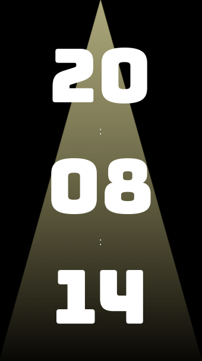
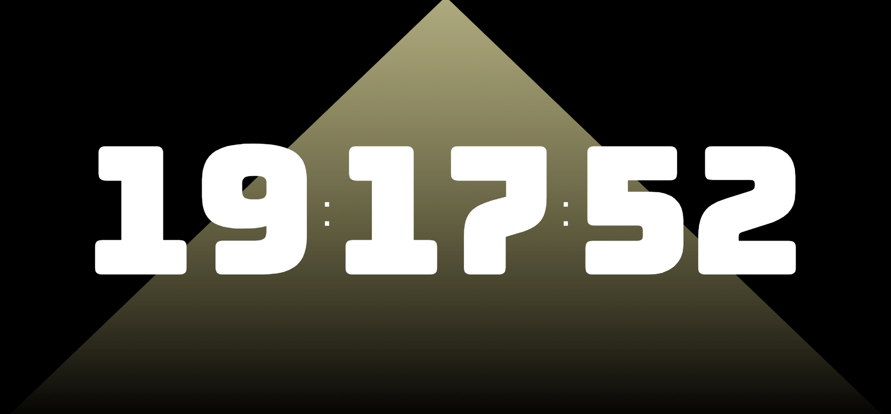

# What Time Is It Right Now?

## Overview

"What Time Is It Right Now" is an interactive web application that displays the current time with a unique visual twist. It combines functionality with aesthetics to create an engaging user experience.

## Features

1. **Real-time Clock Display**: The application shows the current time, updating every second to display hours, minutes, and seconds.

2. **Day/Night Mode**: The interface automatically switches between day and night modes based on the time of day. During daytime hours, it displays a white background with black text, while at night, it shows a black background with white text.

3. **Animated Light Beam**: In night mode, the app features an animated light beam effect, creating a visually striking display.

4. **User Time Tracking**: This line also displays the amount of time the user has spent on the page.

5. **Responsive Design**: The application is designed to work well on both desktop and mobile devices.

## Technical Details

- Built with HTML, CSS, and JavaScript
- Uses Canvas API for advanced animations
- Implements local storage for persisting user data

## How to Use

Open index.html

## Philosophy

> The world is vast and wide. Why do you put on your seven-piece robe at the sound of the bell?
